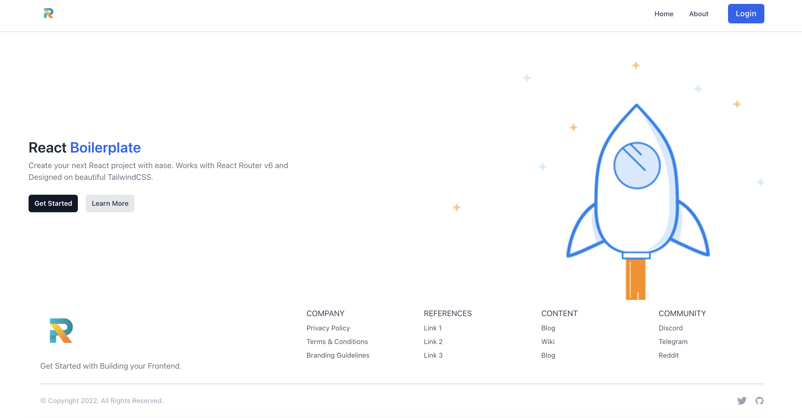

# Boilerplate for your next webapp 🧑‍💻 

## What's in it: 💼 
- [React](https://reactjs.org/).
- [Create React App](https://github.com/facebook/create-react-app).
- [React Router v6](https://reactrouter.com/).
- [Tailwind CSS](https://tailwindcss.com/).
- Components divided.

## Structure: ⚙️
```
src
├── App.js
├── components
│   ├── Footer.js
│   ├── Hero.js
│   └── Nav.js
├── index.js
├── routes
│   ├── routes.js
│   └── userRoutes.js
└── views
   ├── Home.js
   ├── NotFoundPage.js
   └── Start.js
```

### Screenshot:



## How to use this Boilerplate: 🔧
1. Clone the new repo: `git clone git@github.com:anistark/react-router-tailwind-boilerplate.git`. (You can also **fork** the repo and then clone it.)
2. `cd react-router-tailwind-boilerplate`
3. Node version built on: `v17.0.1`. You can check your node version by `node -v`.
   1. You can switch to the supported version by using [nvm](https://github.com/nvm-sh/nvm) or [n](https://github.com/tj/n). Example: `nvm use 17`.
   2. If you use some other version of node. Feel free to check the compatibility and [report back](https://github.com/anistark/react-router-tailwind-boilerplate/issues/new/choose) if it doesn't work.
4. Setup Dependencies: `npm install` or `yarn install`.

## Available Scripts: ✔️

In the project directory, you can run:

### `npm start`

Runs the app in the development mode.\
Open [http://localhost:3000](http://localhost:3000) to view it in your browser.

The page will reload when you make changes.\
You may also see any lint errors in the console.

### `nodemon`
[Nodemon](https://nodemon.io/) helps in auto-reloading your application on detecting any changes to your js code. Very useful while developing. Instead of `npm start` as stated above you can use `nodemon`. Do make sure that nodemon is installed globally against your node verison prior. Install using: `npm install -g nodemon`.

### `npm test`

Launches the test runner in the interactive watch mode.\
See the section about [running tests](https://facebook.github.io/create-react-app/docs/running-tests) for more information.

### `npm run build`

Builds the app for production to the `build` folder.\
It correctly bundles React in production mode and optimizes the build for the best performance.

The build is minified and the filenames include the hashes.\
Your app is ready to be deployed!

See the section about [deployment](https://facebook.github.io/create-react-app/docs/deployment) for more information.

### `npm run eject`

**Note: this is a one-way operation. Once you `eject`, you can't go back!**

If you aren't satisfied with the build tool and configuration choices, you can `eject` at any time. This command will remove the single build dependency from your project.

Instead, it will copy all the configuration files and the transitive dependencies (webpack, Babel, ESLint, etc) right into your project so you have full control over them. All of the commands except `eject` will still work, but they will point to the copied scripts so you can tweak them. At this point you're on your own.

You don't have to ever use `eject`. The curated feature set is suitable for small and middle deployments, and you shouldn't feel obligated to use this feature. However we understand that this tool wouldn't be useful if you couldn't customize it when you are ready for it.

## Learn More: 📜

You can learn more in the [Create React App documentation](https://facebook.github.io/create-react-app/docs/getting-started).

To learn React, check out the [React documentation](https://reactjs.org/).

### Code Splitting

This section has moved here: [https://facebook.github.io/create-react-app/docs/code-splitting](https://facebook.github.io/create-react-app/docs/code-splitting)

### Analyzing the Bundle Size

This section has moved here: [https://facebook.github.io/create-react-app/docs/analyzing-the-bundle-size](https://facebook.github.io/create-react-app/docs/analyzing-the-bundle-size)

### Making a Progressive Web App

This section has moved here: [https://facebook.github.io/create-react-app/docs/making-a-progressive-web-app](https://facebook.github.io/create-react-app/docs/making-a-progressive-web-app)

### Advanced Configuration

This section has moved here: [https://facebook.github.io/create-react-app/docs/advanced-configuration](https://facebook.github.io/create-react-app/docs/advanced-configuration)

### Deployment

This section has moved here: [https://facebook.github.io/create-react-app/docs/deployment](https://facebook.github.io/create-react-app/docs/deployment)

### `npm run build` fails to minify

This section has moved here: [https://facebook.github.io/create-react-app/docs/troubleshooting#npm-run-build-fails-to-minify](https://facebook.github.io/create-react-app/docs/troubleshooting#npm-run-build-fails-to-minify)

## More Tailwind UI Components: 🎨
- [MerakiUI](https://merakiui.com/components/#)
- [GustUI](https://www.gustui.com/docs/application/components/alerts)
- [Tailwind-Kit](https://www.tailwind-kit.com/)
- [LofiUI](https://lofiui.co/)
- [WindStrap](https://windstrap.netlify.app/)
- [Tailwind Components](https://tailwindcomponents.com/components)
- [Treact](https://treact.owaiskhan.me/)
- [Kometa UI](https://kitwind.io/products/kometa/components)
- [Tailblocks](https://tailblocks.cc/)
- [Tailwind Toolbox](https://www.tailwindtoolbox.com/starter-components)
- [Mamba UI](https://mambaui.com/components)
- [Kutty](https://kutty.netlify.app/components/)
- [Daisy UI](https://daisyui.com/components/button)
- [Wicked Blocks](https://blocks.wickedtemplates.com/#elements)
- [Headless UI](https://headlessui.dev/)
- [Tailwind UI Kit](https://tailwinduikit.com/components/E-commerce/Components/footers)

# Contribution Areas: 🙌 
1. Add a new feature. Just [check open PRs](https://github.com/anistark/react-router-tailwind-boilerplate/pulls) if someone else is already working on have worked on it the past.
2. [Request new Features](https://github.com/anistark/react-router-tailwind-boilerplate/issues/new/choose).

---

*Follow me on [github](https://github.com/anistark) and [twitter](https://twitter.com/kranirudha) for more updates and staying updates with my work ✨*
